CUDA Denoiser For CUDA Path Tracer
==================================

**University of Pennsylvania, CIS 565: GPU Programming and Architecture, Project 4**

* Bora Ersoy
* Tested on: 13th Gen Intel(R) Core(TM) i7-13700HX, 2100 Mhz, 16 Core(s), 24 Logical Processor(s), RTX 4060 8GB AD107

### CUDA DENOISER

This project is a implementation of the [Edge-Avoiding À-Trous Wavelet Transform for fast Global Illumination Filtering](https://jo.dreggn.org/home/2010_atrous.pdf) into a CUDA pathtracer.
This paper introduces an edge-aware À-Trous wavelet filter for fast denoising of noisy Monte Carlo global illumination images. By combining a multi-scale à-trous convolution with edge-stopping weights based on geometry and illumination differences, the method preserves sharp features like shadows and edges while smoothing noise and runs fast enough for interactive rendering. It lets a renderer produce smooth indirect lighting with far fewer samples than standard path tracing.

### Features
  - Geometry Buffer visualisation
  - Comparison with simple blur and edge avoiding blur
  - Filter size and weight parameters
  - Integration with main path tracer for more complex scenes
  - Performance impacts of the method

### Geometry Buffer

Geometry buffer is visualized here. You can see positions and normals  of the scene by clicking show PBuffer and NBuffer checkboxes. 

| Positions | Normals |
| ---- | ----|
|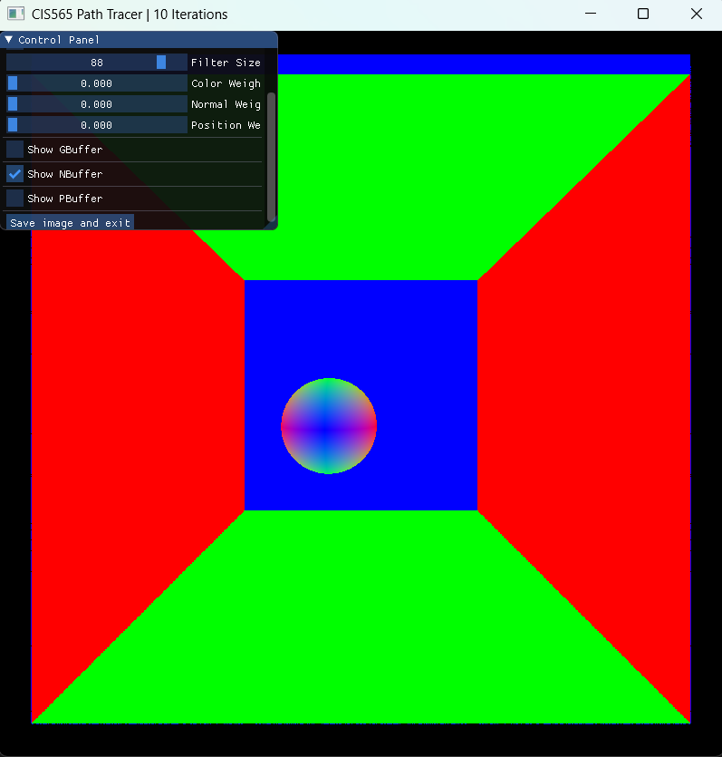|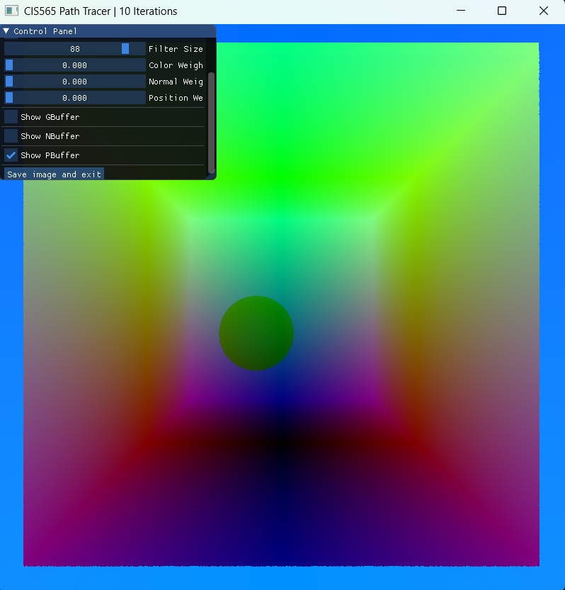|

### Comparison with simple blur and edge avoiding blur
Cornell Ceiling Light scene with 10 samples, color weight = 0.522, normal weight = 0.177, position weight = 0.720 with filter size 88
| Noisy Image | Simple Blur | Edge avoding blur |
| ---- | ----| ---- |
|||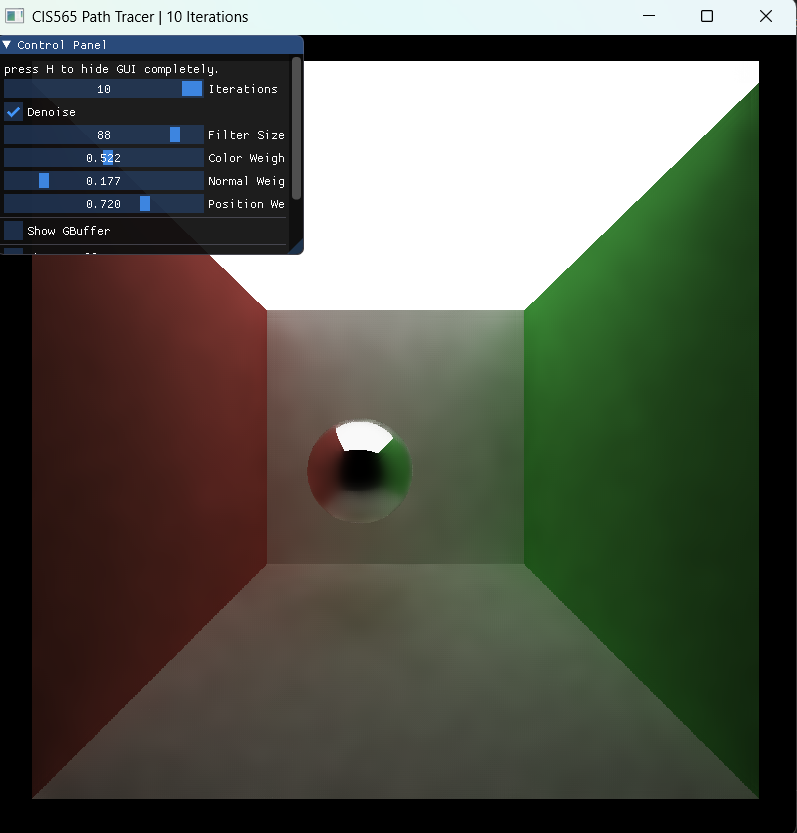|

### Visual Analysis

It took 100 iterations to achieve the smooth look of pathtraced imaged of 4000 iterations. So the tecnique really does the work of hours of pathtracing.

| Pathtraced Image 4000 samples | Denoised imaged 100 samples |
| ----- | ----- |
|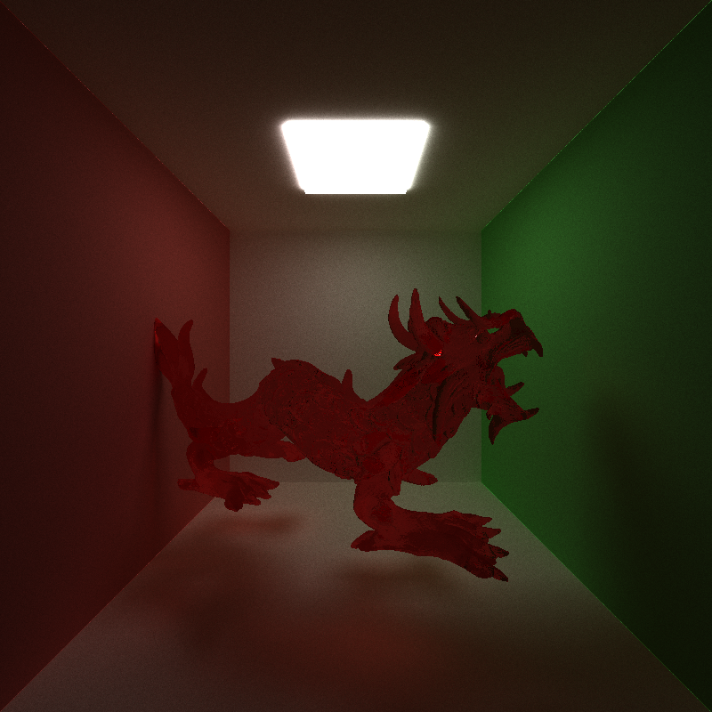|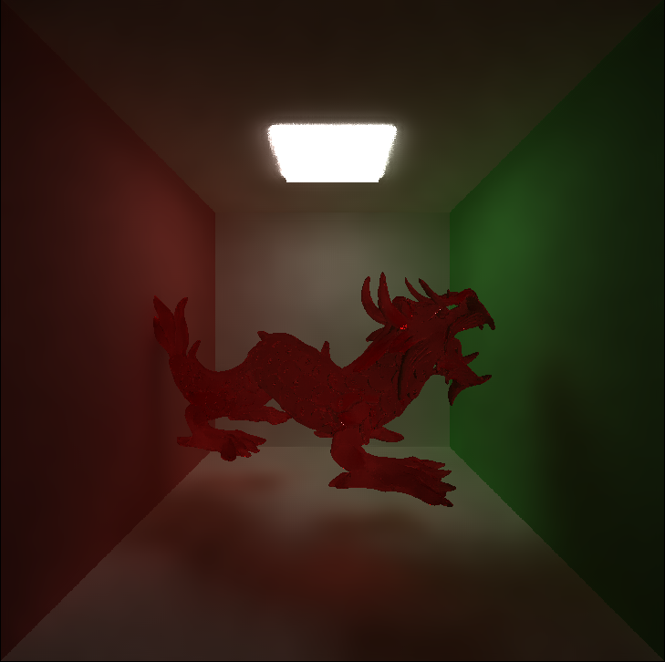|

### Varying Filter Size

Blur  increases with increasing filter size also amount of detail decreases if the filter size is too much

| Filter Size | Denoised |
|-----|  ---- |
| 20 | 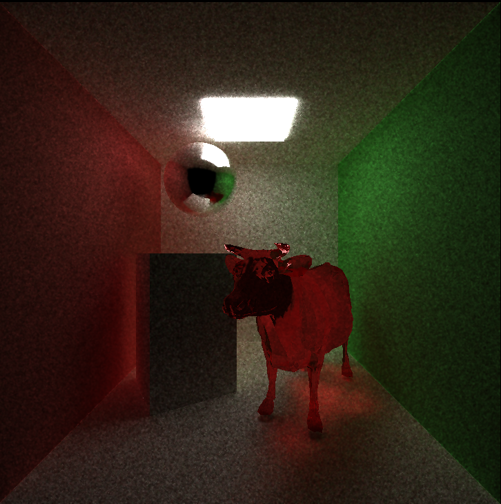 |
| 40 | 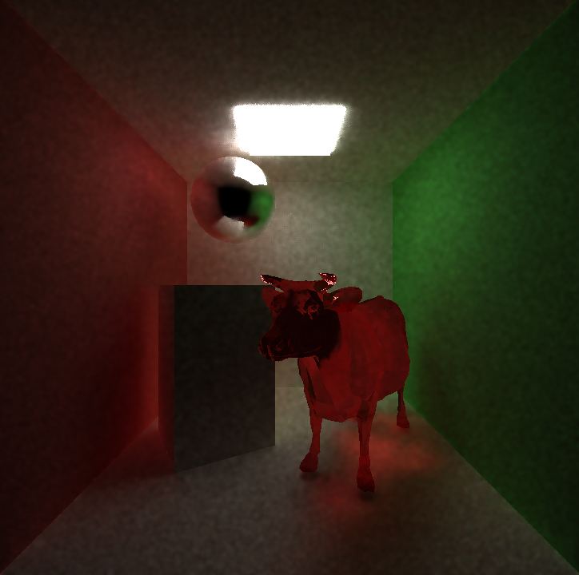 |
| 60 | 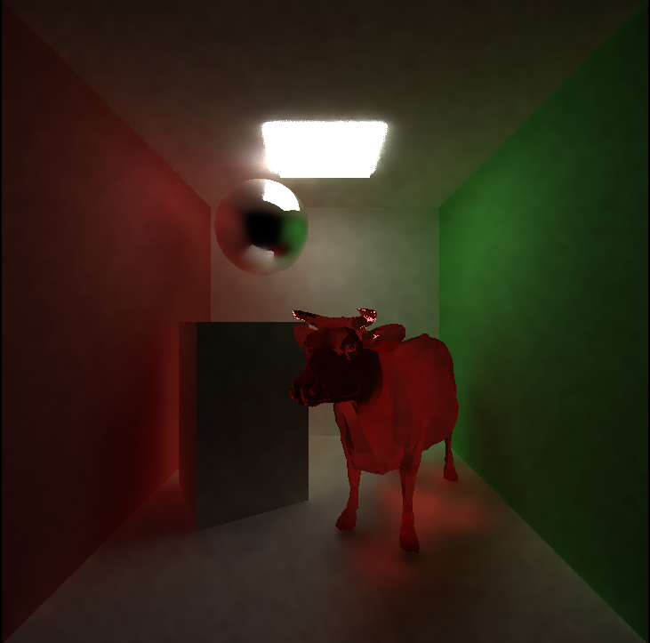| 
| 80 | 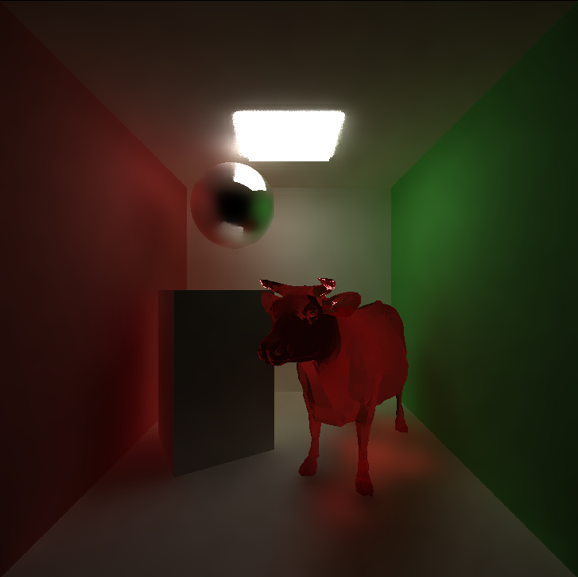 |
| 100 | 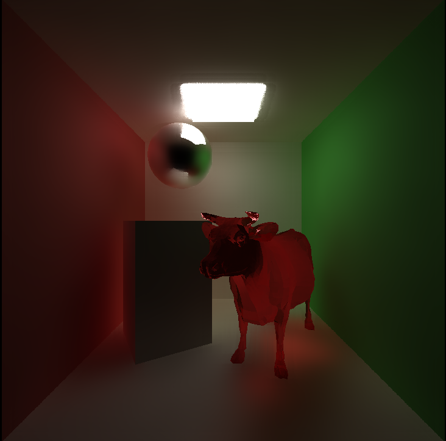|

### Comparison between scenes with small ceiling light and large ceiling light

More light means more sampling and less noise. So the scene with large ceiling light is less noisy than the scene with small ceiling light.

| Small Ceiling Light | Large Ceiling Light |
| ----- | ----- |
|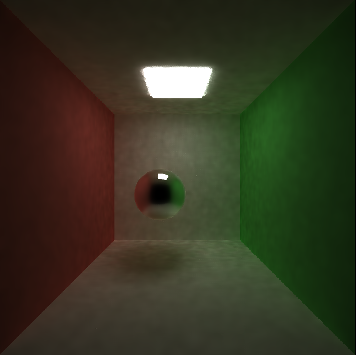|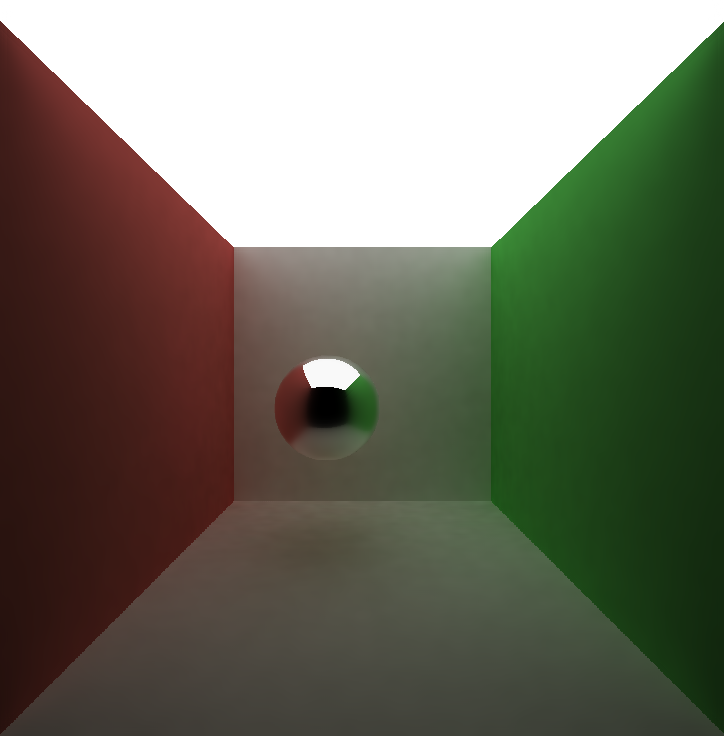|

### Performance Impacts

### Denoising overhead with varying filter size

Denosing is not dependent to the scene complexity but it is dependent to the filter size. It goes linearly with filter size.

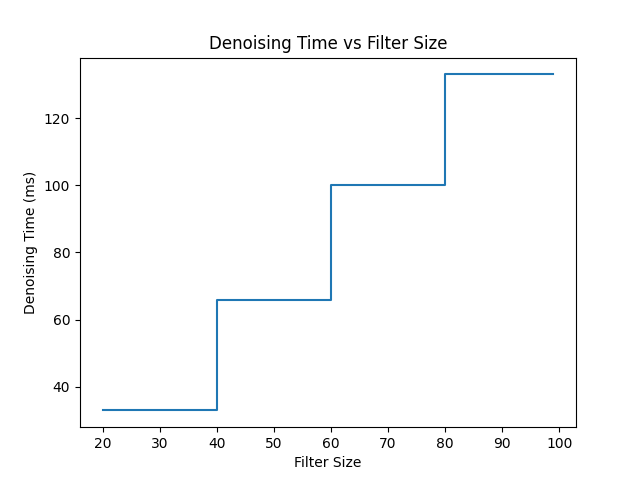

### Denosing time with varying resolution

Denoising algorithm scales approximately O(N) with respect to pixel count

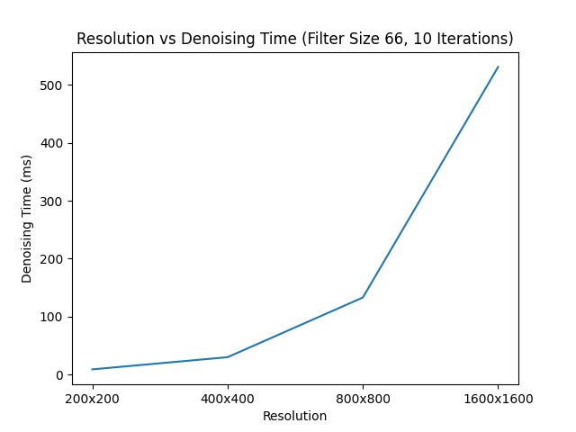

### 

